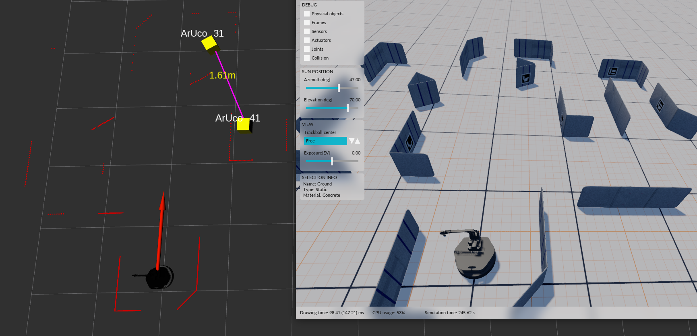
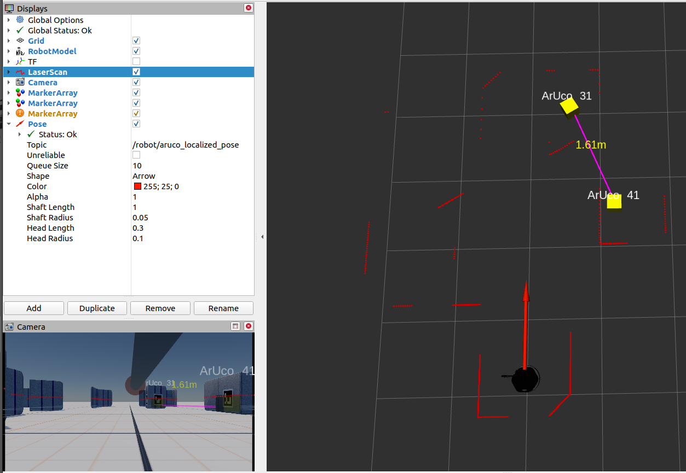
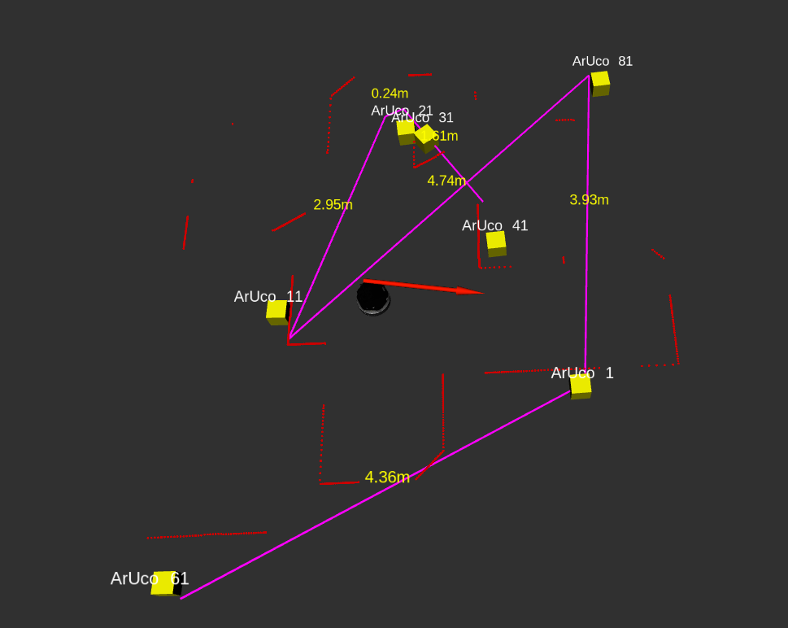
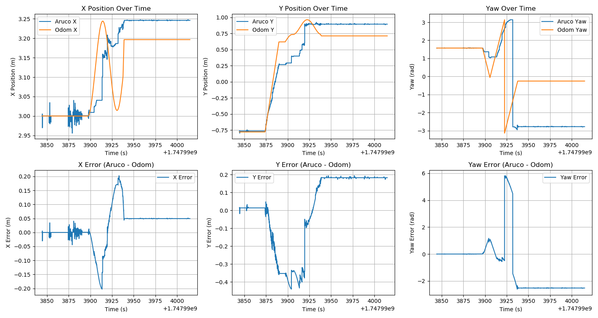
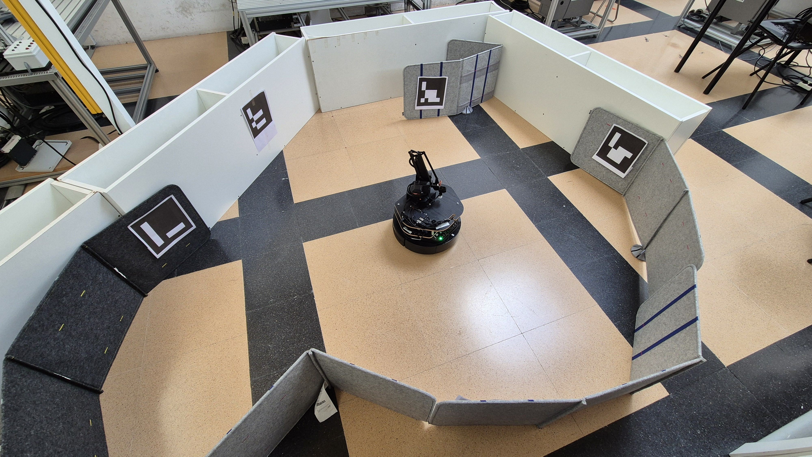

# ArUco-Based Visual SLAM

A ROS-based vision localization system that estimates a robot's global pose using **ArUco markers**, **multi-marker pose fusion**, and a **dynamic marker graph**. The system provides accurate and drift-resistant localization in indoor GPS-denied environments without requiring a traditional SLAM backend.

---

## Overview

This project implements a lightweight visual localization pipeline for mobile robots using ArUco fiducial markers. Instead of relying solely on wheel odometry—which accumulates drift over time—the system estimates the robot's global pose by detecting multiple ArUco markers and fusing their pose estimates into a single robust localization result.

The project was developed and evaluated on both a simulated environment and a real TurtleBot equipped with an Intel RealSense D435i RGB camera.

---

## Project Demonstration

### Simulation Environment



### RViz Localization View



### Dynamic Marker Graph



### Simulation Pose Comparison



### Real-World Robot Setup



## Key Features

* Real-time ArUco marker detection using OpenCV
* Multi-marker pose estimation and averaging
* Dynamic marker graph construction
* Global robot localization in ROS
* RViz visualization of markers, graph, and robot pose
* Works in both simulation and real-world environments
* Reduced localization drift compared to wheel odometry

---

## System Pipeline

```text
RGB Camera
     │
     ▼
ArUco Marker Detection
     │
     ▼
Pose Estimation (solvePnP)
     │
     ▼
Dynamic Marker Graph
     │
     ▼
Multi-Marker Pose Fusion
     │
     ▼
Robot Global Pose
     │
     ▼
RViz Visualization
```

---

## Technologies Used

* ROS (Robot Operating System)
* Python
* OpenCV
* ArUco Library
* Intel RealSense D435i
* RViz
* CMake
* TurtleBot

---

## Project Structure

```text
aruco-based-visual-slam/
├── aruco_slam_hop/
├── launch/
├── msg/
├── src/
├── CMakeLists.txt
├── package.xml
└── setup.py
```

---

## Methodology

The localization pipeline follows these steps:

1. Detect ArUco markers from the RGB camera stream.
2. Estimate each marker's 6-DoF pose using OpenCV's `solvePnP`.
3. Build and update a dynamic graph containing marker poses in the world frame.
4. Compute individual robot pose estimates from every visible marker.
5. Fuse multiple observations through translation averaging and quaternion-based rotation averaging.
6. Publish the final robot pose for visualization and navigation.

---

## Experimental Evaluation

The system was evaluated in:

* **Stonefish simulation**
* **Real TurtleBot laboratory environment**

Results demonstrate:

* Accurate global localization
* Significant reduction of odometry drift
* Stable pose estimation when multiple markers are visible
* Real-time operation suitable for indoor environments

---

## Future Improvements

* EKF-based sensor fusion with IMU and wheel odometry
* Graph optimization backend
* Confidence-weighted marker fusion
* Robust outlier rejection
* Automatic marker mapping
* Extension to larger 3D environments

---

## Publication

This repository accompanies the project:

**"ArUco-Based Robot Localization Using Marker Graph and Multi-Marker Pose Averaging"**

Authors:

* Jamin Rahman Jim
* Priyam Gupta
* Ryan Crowell

---

## License

This project is intended for academic and research purposes.
